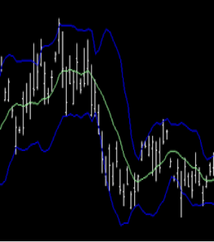
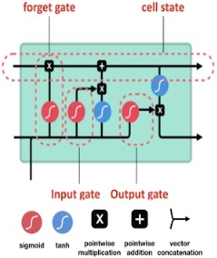
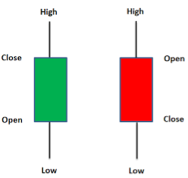
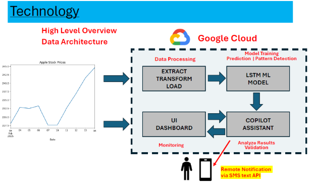



**Augmented Intelligent Risk-Based Financial Trading with LSTM Models** 

**Matthew Harper** 

*MS Data Science* | *MS Computer Science* | *BS Electrical Engineering*

**Abstract**

** Approximately 90% of the world’s data has been created in the last two years, most of which is not directly viewed or analyzed by humans. In addition, as artificial intelligent systems experience expanding roles in applications including generative and agentic AI, as many as 85% of workers now believe that AI will significantly impact their job within the next 3 years [1]. This AI project explores the use cases of integrating augmented intelligence as a risk based financial trading virtual assistant in the form of an agentic AI agent which utilizes a Long Short-Term Memory (LSTM) machine learning model to assist in human decision making and perform actionable stock trading tasks in real-time based on price prediction. Moreover, model training presented in this paper demonstrates significant predictability of stock asset price action with a mean absolute percentage error (MAPE) of .0236 and root squared error (R2 Score) equal to .9337 which demonstrates a good model fit when compared with actual stock price data from 2021 to 2025.

9

**1          Introduction** 

**AI Advances and Impact on Workforce**

In the modern digital era, an overwhelming volume of information is being generated at unprecedented rates. Remarkably, around 90% of the world’s data has been produced and within just the last two years—a trend driven by the transformation of connected devices, social media platforms, enterprise systems, and sensor networks. However, a vast portion of this data remains unstructured and is not directly interpreted by humans. Instead, it is usually ignored in its meta data state and left to be processed by intelligent systems. As artificial intelligence continues to evolve, particularly with advancements in generative AI (which can create new content) and agentic AI (which can take autonomous actions), its influence on society is becoming more pronounced. According to recent workforce studies, approximately 85% of employees believe AI will significantly reshape their roles within the next three years, indicating a broad recognition of AI's transformative potential in the workplace.

**Purpose and Vision of the Project**\
As AI systems increasingly penetrate organizational operations and decision-making processes, many job functions are being redefined or augmented by intelligent automation. Rather than replacing human roles outright, this AI project is focused on showcasing the positive potential of AI integration. 

By designing and implementing a functional proof of concept, the project aims to evaluate AI’s practical benefits and demonstrate that its advantages—such as efficiency, accuracy, and scalability—far outweigh any perceived drawbacks. 

The ultimate goal is to foster trust and awareness around AI adoption by highlighting its ability to assist, rather than replace, human workers. Moreover, by working as a team, both human workers can become more efficient and live a richer more abundant life.

**Agentic AI for Financial Trading**\
This project specifically explored the integration of augmented intelligence into the high-stakes environment of financial trading. The project centered on the development of an AI-driven virtual assistant, designed as an agentic AI system capable of making autonomous yet assistive decisions. 

Through the application of an Long Short-Term Memory (LSTM) machine learning algorithms, the virtual assistant has demonstrated an ability to support human traders by interpreting market signals, identifying trading opportunities, and executing decisions in real-time. This real-time responsiveness, when paired with AI's ability to analyze vast data sets, positions the assistant as a powerful tool in helping traders navigate volatile and complex financial markets with greater confidence.

**Motivation and Intended Outcomes**\
The primary motivation behind this project was to demonstrate a real-world use case for AI that can directly benefit investors. In the context of online trading, users often struggle with the cognitive overload of tracking multiple assets, interpreting financial news, and executing trades efficiently. 

By leveraging augmented intelligence of the LSTM machine model, the supervised AI assistant exhibited a significant ability to recognize market patterns, predict trends, and conduct even infer sentiment analysis based on embedded stock candle stick box plot characteristics. 

In addition, the AI based stock trading bot utilized risk-based controls in real time, helping users reduce potential trading losses and optimize their profit margins. The stretch goals is and should be to improve the trading experience while minimizing the manual burden on users.

**Technical Trading, AI, and Human Limitations**

Technical stock trading demands the simultaneous analysis of numerous key performance indicators (KPIs), including moving averages, momentum oscillators, and volume trends. Traders must also react to rapid market changes and unpredictable news events. These dynamic conditions often exceed human cognitive capabilities in terms of both speed and precision. 

The proposed AI solution addresses this limitation by functioning as an intelligent pattern recognition agent, capable of processing data at machine speeds and identifying actionable insights. Through this augmented intelligence approach, traders are equipped with a tool that enhances their decision-making capacity without requiring them to process all raw data themselves.

**2          Background** 

**LSTM Model Applications in Augmented Intelligent Pattern Recognition**

Long Short-Term Memory (LSTM) models are a type of recurrent neural network (RNN) particularly well-suited for time series forecasting and sequence analysis. In the context of augmented intelligence, LSTM models enable systems to recognize and learn from historical data patterns over time, making them highly effective for stock market prediction. Their ability to capture long-term dependencies in financial time series data allows them to model complex temporal relationships between variables, such as price movements, volume, and volatility. 

When integrated into a trading assistant, LSTMs can provide continuous learning capabilities, adapt to new market behaviors, and generate accurate predictions that inform trading decisions. This not only enhances the pattern recognition capabilities of the AI assistant but also contributes to smarter, data-driven decision-making by augmenting the trader's situational awareness and strategic planning.

The LSTM networks can be viewed as a variation of recurrent neural networks that are considered one of the most utilized sequence modeling techniques which can be applied to many practical applications [2,3]. 

Long short-term memory (LSTM) models are special cases of recurrent neural networks in which special feedback loops are used to produce paths for the gradient to flow for longer periods of time or durations than its RNN counterpart. In a typical RNN, the information in the short-term memory is often replaced as new information is fed back into the network over time. This is typically an RNNs model can perform well when the gap between the relevant information and the place that is needed is small. An example would be for language processing to determine the next word in a sentence [4].

For applications requiring relevant information or to perform a task that is far away or that requires larger memory. RNNs typically have problems for long term memory tasks because their feedback loop is on a fixed time scale and ,as a result, the needed information is typically replaced by other information in the short-term memory by the time it is needed for the creation of longer acquired contextual information [2]. Moreover, cases where contextual information is required over a paragraph or perhaps a page of words and sentences and other large data sets require longer term memory for optimal performance. RNNs usually do not perform as well as LSTM models in these scenarios [4].

Long Short-Term Memory (LSTM) models on the other hand perform well when longer short-term memory is required for applications such as handwriting recognition, speech recognition, contextual based pattern recognition, and machine translation among others [1,2,4].

LSTM model variation is largely a result of a weighted self-loop that allows dynamically conditioned information flow on the context rather than a fixed loop compared to RNNs. This is accomplished with the use of three primary gate layers which include: input gate, forget gate (feedback gate), and the output gate [4]. 

In short, the base case for use of the LSTM model for stock price prediction allows for the use of larger data sets while allowing for long and attention based short term memory which exhibit enhanced pattern recognition specifically when analyzing 5 years or more of time-based data.

**3	LSTM Model & Results** 

**Model Architecture Design**

At the core of the proposed solution is an AI-based model that acts as an intelligent agent capable of recognizing trading patterns and predicting future stock movements. This model will be trained using historical stock data, allowing it to understand individual stock behaviors and tendencies across different market conditions. The agent will make vector-based predictions that estimate both the magnitude of price changes and their directional movement (i.e., upward or downward trends), accompanied by a confidence level. 

The flexibility of the model allows it to be customized per stock ticker, enabling tailored performance. The end-user will interact with the system via an intuitive dashboard that serves as the trading interface. This front-end UI will visualize predictions, provide trade suggestions, and potentially allow for real-time execution, transforming the way users engage with financial markets. **(**see Full-Stack Architecture**)**

**Description of Data Set**

The data set is a time-based numerical data set containing features of date, close, open, high, low, and volume of which closing price or [‘Close’] is the target variable that will be predicted by the model.

Below is a tabled example of the data set imported and utilized for model training.

|**Date**|**Open**|**High**|**Low**|**Vol**|**Close**|
| :- | :- | :- | :- | :- | :- |
|YYYY-MM-DD|105|107|105|10346|106|

This data can also be visualized in a popularized box-plot style of chart visualization commonly referred to as the candlestick chart illustrated below.

**Feature Selection**

Feature selection is determined in the create dataset function in which the feature objects or variables are selected and the target variable is selected as follows:

Feature variable [X] = [High, Low, Open, Volume], all index locations 

Target Variable [Y] = [Close] index location is 3

time\_step = Window size of previous or past trading days in steps to utilize for model training as input to predict the next days stock price for each epoch iteration.

**LSTM Model Code Review**

The LSTM model was constructed using the tensor flow keras LSTM import module function which uses the sequential model with type LSTM with the following parameters: LSTM(hidden, dropout, density, training split)

Hidden Layers = 50 hidden layers

Dropout = Set to .2 which is a regularization technique utilized in deep learning models to prevent overfitting by deactivating a percent of neurons during training. 

If this parameter is significantly high, the model becomes inefficient and difficult to train and if too low can possible memorize the data set and create a condition of overfitting and loss of generalization.

Density (dense) = Amount of fully connected layers that process the output of the LSTM layers prior to final prediction.

Training Split = 80% Train and 20% Test

**Final Hyperparameters Utilized**

The following hyperparameters were utilized in the model which included:

Learning Rate = .001 (here if this it too little model training becomes inefficient and reduces training progress, however, if too high can reduce the model’s ability to identify local maxima’s and local minima effectively)

Loss Function = MSE (mean squared error) is utilized to calculate the gradient descent and cross entropy which determines how the much the model is learning and improving each epoch iteration.

Epochs = 100 (number of iterations in the model learning training process.)

Batch Size = 32 (Number of training sets/samples processed per gradient update (i.e. epoch).

Early Stopping = Early stopping techniques aim to eliminate unnecessary trial and error on model epochs and use dynamic model gradient descent 

to determine when to stop training as model improvement slows or stops. 

Patience = 10 (10 epochs without improvement equal to or less than min delta)

Delta = .001 ( a good rule of thumb is similar to learning rate).

**Model Results**

Results indicated the following accuracy: 

**MAPE** (Mean Absolute Percentage Error): 2.36%

**RMSE** (Root Mean Squared Error): 6.3330

**R² Score**: 0.9337 (model fit)

The model training performance and learning rate are feature in the figure below. With early stopping active, the model was successfully trained in under 35 epochs.

**4	Project Challenges & Innovation**  

**Model Computation Challenges**

At the core of the proposed solution is an AI- based model that acts as an intelligent agent which is capable of recognizing trading patterns and providing the user with situational awareness and insights. However, training the model for each user selected stock requires high-performance computational power and poses a technological challenge for most web-based hosting platforms. 

In fact, most machine learning models, especially deep learning models like the LSTM model utilized in the project, require substantial computational power for training and inference. GPUs (graphical processor units) or specialized processors like TPUs which are often used due to their parallel processing capabilities, which are crucial for efficiently handling large datasets and complex algorithms within a small amount of time complexity.

For example, the Nvidia T4 GPU is a tensor processing unit which uses an AI accelerator to increase performance and accelerate diverse cloud workloads, including high-performance computing, deep learning training and inference, machine learning, data analytics, and graphics.

For the project, the LSTM model as tested, required a training time of approximately 3-4 minutes using a T4 GPU to process five years of stock data as a sample size. This posed a challenge during deployment because the cloud hosting and deployment environment was not able to support this. Moreover, the Streamlit Cloud published computational processing power is rated at 1-3 GB over a Debian based operating system.

**Solution**

As a result, the project required a way in which a model could be pre-trained and then fine-tuned and deployed for inference without the use of a continuous high-performance compute resources.

The resulting solution was to train the model on a selected data set such as the Nasdaq, or a highly volatile stock with lots of training data such as TSLA. Once trained which takes 3-4 minutes, the model can be utilized to infer a stock price prediction based on any candle stick stock chart symbol and program.

This method allowed for the fine-tuning of model parameters such as the ticker symbol and adjustable time step and look-back window size for the desired prediction resolution and sensitivity.

Additionally, because of the lightweight full stack architecture, the entire system was able to be fully functional and hosted in a free Streamlit Cloud environment. Alternative solutions would require the hosting and AI model generation and computational processing which requires fees of $300-$500 per month if the model were to be utilized throughout each trading day.

**5	Full Stack Architecture**  

The full stack architecture was divided into 5 major functional components including the following:

1\. Model Training - LSTM Model Training

2\. Model Deployment (i.e. Loading Model)

3\. Model Fine-Tuning – Tuning for specific LSTM Model Inference for Stock Prediction.

4\. Predict - Generate Stock Predictions Continuously for some specified time period (i.e. 1 sec, 5 sec, etc.).

5\. Visualize - UI/UX Dashboard - Visualization predictions and alert user via SMS text on trend changes (UP, DOWN, BUY, SELL, etc.)

The figure below illustrates the data pipeline and final architecture.

**Cloud**

**6	Conclusion**

Model training and testing have shown that Long Short-Term Memory (LSTM) models are powerful tools in the field of machine learning, particularly for augmenting human decision-making in stock trading. These models are well suited for learning and detecting long term dependencies from historical time-series data and identifying underlying patterns in market behavior, making them highly effective for risk-based prediction tasks. When augmented with real-time artificial intelligence enhancements, LSTMs serve as dynamic decision-support systems that can react to live market changes and provide timely, data-driven insights to traders.

Despite the promising initial results from early versions of the model, further research, evaluation, and full-stack development are necessary for a complete integration into a functional stock trading assistant. This includes refining the back-end processing pipeline to optimize performance and scalability, as well as developing a user-friendly front-end interface that delivers actionable insights clearly and intuitively. 

At the core of the solution lies an AI model that functions as an intelligent agent—capable not only in the identification of trading signals but also learning from new data inputs to improve accuracy over time.

A significant technical challenge faced during development was the need to train and deploy the model without relying on continuous access to high-performance computing resources. To address this, an innovative solution was implemented where the LSTM model could be pre-trained using specific datasets—such as the Nasdaq index or individual high-volatility stocks like TSLA—which provided a rich and varied data regiment for learning market behavior.

Training the model takes approximately 3 to 4 minutes, after which it is capable of performing inference on any stock represented through candlestick chart data. This approach allows users to obtain accurate, real-time predictions across multiple ticker symbols. The model’s architecture supports flexible configuration, enabling custom training for individual stock tickers and adapting to specific behavioral patterns often presented in different securities.

To enhance usability, a front-end dashboard was developed as the primary user interface. This dashboard allows traders to interact with the system by selecting ticker symbols, setting prediction parameters, and viewing live forecasts. The predictions are visualized alongside trend directions, and suggested trading actions. This real-time interactivity empowers users to make informed decisions quickly and confidently.

The model also supports fine-tuning through adjustable parameters, such as the time step and look-back window size. These parameters determine how far back in time the model looks for patterns and how frequently it updates predictions. Such customization enables the system to deliver varying levels of prediction resolution and sensitivity, which can be tailored to suit different trading styles—whether short-term scalping or long-term position holding.

In summary, this approach provides a practical and scalable solution for deploying LSTM models in real-time trading environments, while reducing computational costs and maintaining flexibility and user control. By bridging machine intelligence with human insight, the AI trading assistant aims to enhance trading efficiency, accuracy, and profitability.

**References**

[1] Hanowell, B. (2024, August 27). *Most workers think AI will affect their jobs. They disagree on how.* ADP Research. <https://www.adpresearch.com/worker-sentiment-ai-impact/>

[2] Goodfellow, I., Bengio, Y., & Courville, A. (2016). Deep learning. MIT Press.

[3] Cheng, C. (2023, May 6). Principal Component Analysis (PCA) Explained Visually with Zero Math. Medium. https://towardsdatascience.com/principal-component-analysis-pca-explained-visually-with-zero-math-1cbf392b9e7d

[4] Sharda, R., Delen, D., & Turban, E. (2020b). Analytics, data science, and artificial intelligence: Systems for Decision Support, Global Edition.

[5] How LSTM Networks Work? A Simple Explanation of LSTM in Deep Leaning., Skillcate AI et.al.

https://www.youtube.com/watch?v=guqgmVqcy2c

[6] Wikipedia contributors. (2024, November 13). Open-high-low-close chart. Wikipedia. https://en.wikipedia.org/wiki/Open-high-low-close\_chart
